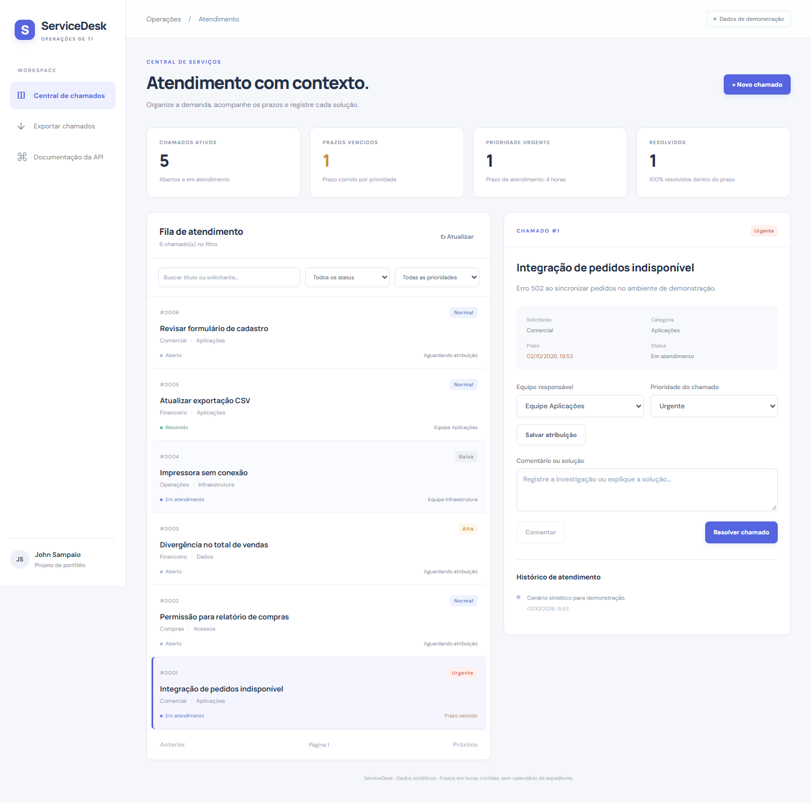
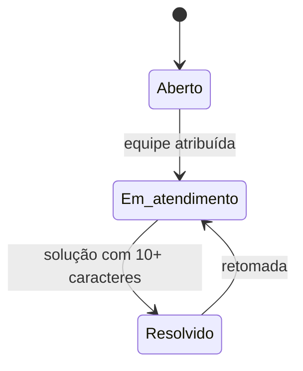

# ServiceDesk · Central de chamados

[](https://github.com/JVCSampaio/service-desk/actions/workflows/ci.yml) · [Portfólio](https://github.com/JVCSampaio)

Sistema de atendimento interno com **React + TypeScript**, **API REST em Python/FastAPI** e **SQLite**.
Uma demanda passa por registro, atribuição, investigação, resolução e possível reabertura, com histórico persistido.



## Problema e entrega

Em um cenário fictício de suporte interno, demandas dispersas dificultam o acompanhamento de responsáveis,
prioridades e soluções. O sistema reúne a fila e o contexto do atendimento na mesma tela.
Todos os dados de demonstração são sintéticos; este é um projeto de portfólio, sem vínculo com clientes ou empregadores.

- Registro com validação de título, descrição, área solicitante, categoria e prioridade.
- Busca, filtros por status/prioridade e paginação no servidor.
- Atribuição de equipe antes de iniciar atendimento.
- Resolução com descrição obrigatória e retomada de atendimento.
- Histórico de criação, atribuições, comentários e transições.
- Controle de versão para recusar alterações baseadas em dados desatualizados.
- Indicadores e exportação CSV com proteção contra fórmulas de planilha.

## Executar

Requisitos locais: **Python 3.14** e **Node.js 24**. Dependências Python e npm estão fixadas.

```bash
python -m venv .venv
```

Ative o ambiente: `.venv\Scripts\Activate.ps1` no PowerShell ou `source .venv/bin/activate` no Linux/macOS.

```bash
pip install -r requirements-dev.txt
cd web
npm ci
npm run build
cd ..
python -m uvicorn app.main:app --host 127.0.0.1 --port 8011
```

Abra **http://127.0.0.1:8011**. A API serve o build React na mesma origem.
Swagger: **http://127.0.0.1:8011/docs**. O banco local fica em `.data/service-desk.db`.
O primeiro início cria seis chamados de demonstração; reiniciar preserva os dados.
`APP_DB` permite escolher outro arquivo SQLite.

Para desenvolver o React com atualização automática, mantenha a API ativa e execute `npm run dev` em `web/`.
O Vite encaminha `/api` para a porta 8011.

### Docker

```bash
docker compose up --build
```

O serviço fica na mesma porta 8011, com volume persistente e publicação limitada ao endereço local.
A imagem compila o React em uma etapa Node e executa a API como usuário sem privilégios administrativos.

## Fluxo e regras



| Prioridade | Prazo corrido desde a criação |
|---|---|
| Urgente | 4 horas |
| Alta | 8 horas |
| Normal | 24 horas |
| Baixa | 48 horas |

O prazo é calculado em UTC; a interface apresenta as datas no fuso do navegador.
Trocar a prioridade recalcula o prazo desde a criação. Retomar atendimento mantém esse marco.
O indicador de prazo dos resolvidos compara a última resolução com o prazo atual;
o histórico mantém as resoluções e reaberturas anteriores.

## API

| Método e rota | Comportamento |
|---|---|
| `GET /api/tickets` | Busca, filtros e paginação; retorna `items`, `total`, `limit`, `offset`. |
| `POST /api/tickets` | Cria chamado e evento na mesma transação. |
| `GET /api/tickets/{id}` | Chamado e histórico ordenado. |
| `PATCH /api/tickets/{id}` | Atualiza equipe/prioridade com `version` obrigatória. |
| `POST /api/tickets/{id}/transitions` | Altera o estado com validação das regras. |
| `POST /api/tickets/{id}/comments` | Acrescenta nota ao histórico. |
| `GET /api/metrics` | Ativos, urgentes, vencidos, resolvidos e proporção dentro do prazo. |
| `GET /api/export/tickets.csv` | Snapshot para análise e Power BI. |

`201` indica criação; `404`, recurso inexistente; `409`, conflito de versão ou regra de negócio;
`422`, entrada inválida. Veja exemplos e decisões em [docs/ANALISE.md](docs/ANALISE.md).

## Verificar

No ambiente Python ativado:

```bash
ruff check app tests
ruff format --check app tests
pytest -q
cd web
npm ci
npm run lint
npm run build
npx playwright install chromium
npm run test:e2e
```

Os testes de API cobrem fluxo completo, versões desatualizadas, rollback, filtros, CSV, prazos e persistência.
Os testes Playwright usam a API e o banco reais: criação, atribuição, resolução, reload e uma tela de 390 px.
Eles usam `.data/e2e.db`, separado do banco de uso local. O CI também constrói e verifica o container.

## Estrutura e limites

`app/domain.py` contém as regras; `app/db.py`, schema e conexões; `app/main.py`, contratos HTTP;
`web/src/`, interface; `tests/` e `web/e2e/`, verificações; `docs/`, requisitos, casos de teste e integração BI.

O escopo é um sistema local de demonstração: não há autenticação, autorização por usuário, anexos,
notificações nem calendário de expediente. As equipes são uma lista fixa. O histórico registra operações,
mas não comprova identidade do operador. Para uso multiusuário real, esses pontos precisam de implementação.
SQLite foi escolhido para execução simples; não foi feito benchmark de capacidade ou migração para PostgreSQL.

Referências: [FastAPI — testes](https://fastapi.tiangolo.com/tutorial/testing/),
[React — estado](https://react.dev/learn/managing-state).

Licença [MIT](LICENSE).
