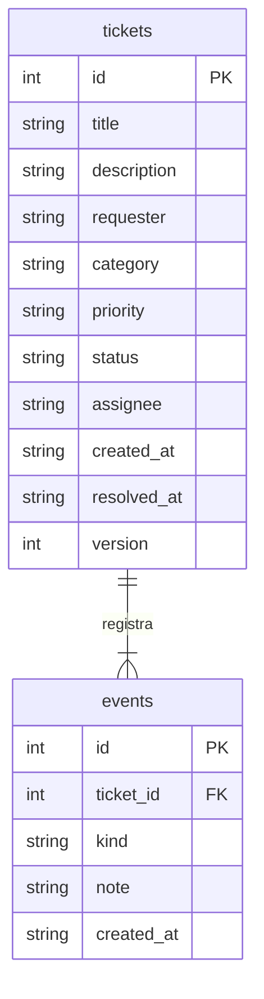

# Análise funcional e decisões

## Demanda

Persona fictícia: equipe de TI que recebe solicitações de aplicações, acessos, infraestrutura e dados.
Objetivo: registrar contexto, distribuir atendimento e manter informação suficiente para uma nova investigação.

| ID | Requisito | Critério de aceite | Evidência |
|---|---|---|---|
| RF01 | Registrar demanda | Campos inválidos não criam chamado; criação válida gera evento. | `test_validation_and_not_found`, teste E2E de criação |
| RF02 | Atribuir atendimento | Não é possível iniciar sem equipe ou remover a equipe em atendimento. | `test_invalid_transition_and_missing_team_are_atomic`, `test_resolution_requires_detail_and_team_cannot_be_removed` |
| RF03 | Registrar solução | Solução exige 10 caracteres; reabertura preserva histórico e prazo-base. | `test_ticket_lifecycle_and_history` |
| RF04 | Evitar sobrescrita | Duas versões antigas não substituem uma alteração mais recente. | `test_optimistic_version_blocks_lost_update` |
| RF05 | Consultar fila | Busca trata `%` como caractere, filtros e página respeitam o limite. | `test_filters_pagination_and_literal_search` |
| RF06 | Exportar informações | CSV inclui prazo/status, sem executar texto como fórmula. | `test_csv_protects_spreadsheet_formulas` |
| RNF01 | Persistência | Reiniciar não apaga tickets nem repete a carga inicial. | `test_restart_preserves_tickets_and_seed_is_not_repeated` |

## Modelo



O schema completo está em `app/db.py`. Chaves estrangeiras são ativadas por conexão.
O banco usa `user_version=1`; uma versão desconhecida interrompe o início, sem tentar converter o arquivo.
Não existe um gerenciador de migrações incremental neste escopo.

## Decisões

- Estado e transições ficam em `domain.py`; a rota traduz violações para HTTP 409.
- O formulário envia `version`; as mutações reservam uma escrita SQLite antes de ler e comparar a versão.
- Atualização e evento fazem parte da mesma transação. Exceções provocam rollback e fecham a conexão.
- Comentários são acréscimos independentes e não alteram `version`; não sobrescrevem a descrição ou a resolução.
- A descrição do chamado é imutável nesta versão. Investigações e correções são registradas como notas.
- Métricas são agregadas sobre a tabela completa, enquanto a fila tem filtros próprios. A interface identifica esse recorte.
- Prazo corrido mantém a regra verificável. Expediente, feriados e pausa por espera externa são trabalho futuro.

## Exemplo de contrato

```json
{"version": 1, "assignee": "Equipe Aplicações", "priority": "high"}
```

`PATCH /api/tickets/1` retorna o chamado atualizado com `version: 2`.
Repetir a versão 1 retorna `409` e a mensagem para recarregar. O frontend exibe a falha e busca o estado mais recente.

## Cenários de teste manual

1. Registrar um chamado e confirmar título e solicitante na fila.
2. Tentar iniciar sem equipe: conferir mensagem e histórico sem transição.
3. Atribuir equipe, iniciar, tentar resolver com “ok”: conferir recusa.
4. Informar solução, resolver e retomar: conferir eventos e prazo original.
5. Abrir o mesmo chamado em duas abas, salvar equipe na primeira e tentar salvar na segunda: conferir 409.
6. Exportar CSV e comparar IDs e estados com a API.

## Registro de falha e manutenção

Durante a implementação, Ruff identificou imports sem uso e construções redundantes; foram corrigidos antes da validação final.
O conjunto de API passou com dez cenários e os dois fluxos de interface foram verificados com backend real.
O TestClient da versão atual de Starlette emite aviso de depreciação para httpx; os testes continuam passando.
Não foi feita validação do Power BI Desktop. Consulte `VERIFICACAO.md` para evidência final e limites.
